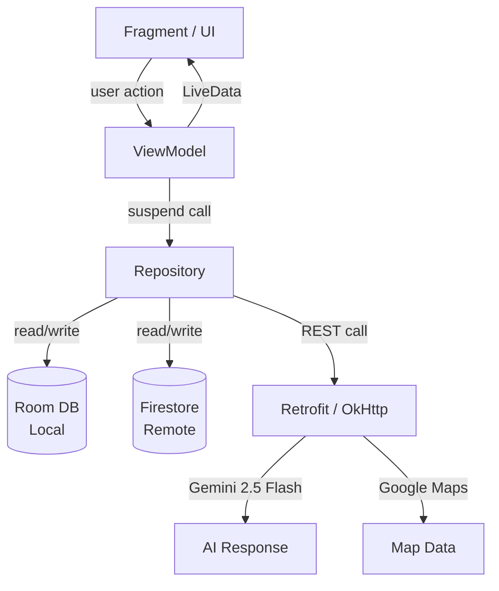
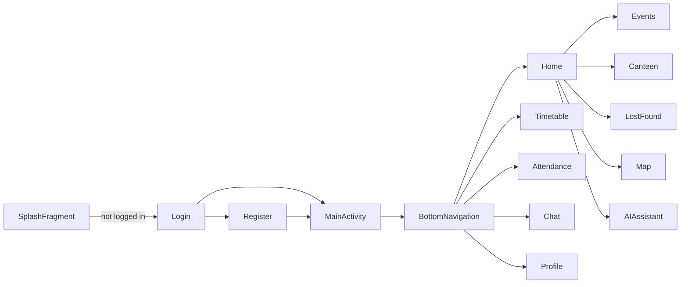
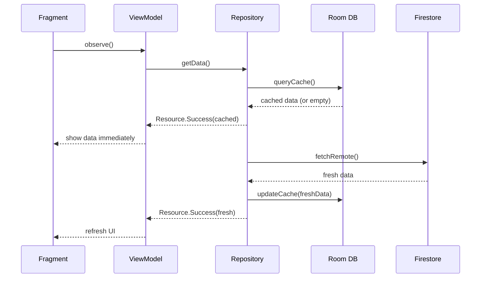
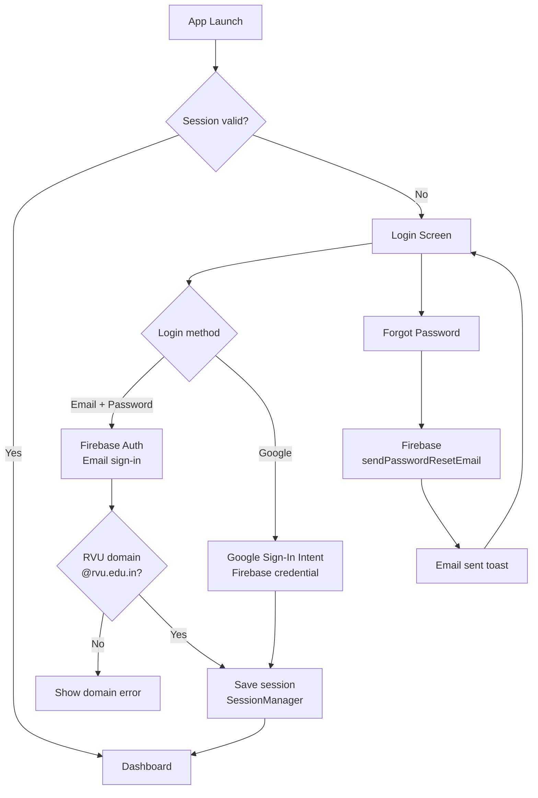
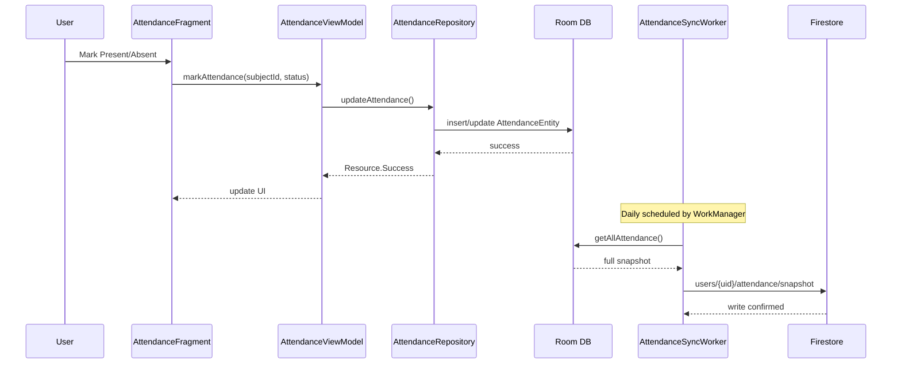
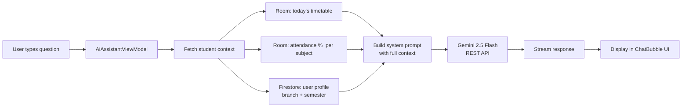
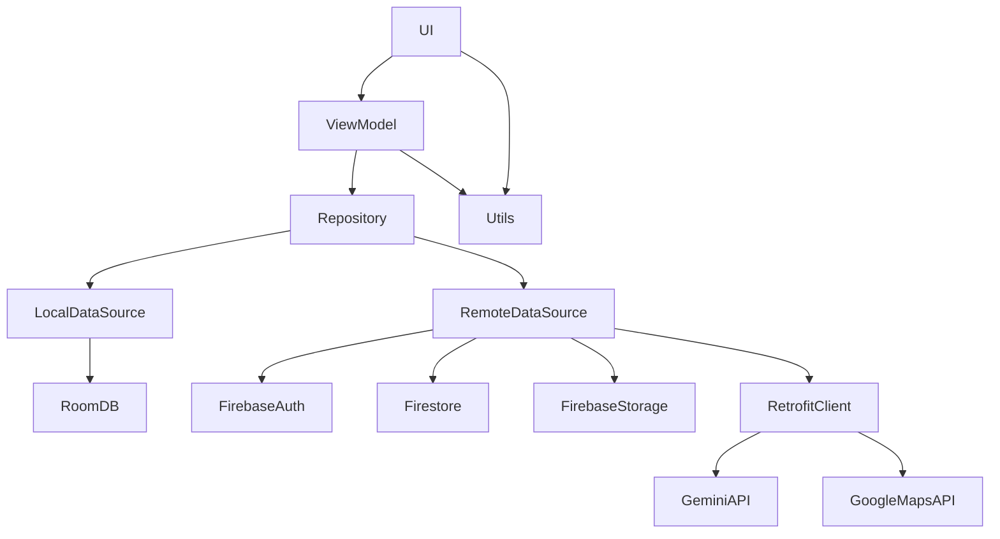

# 🗺️ Architecture Diagrams

All diagrams use [Mermaid](https://mermaid.js.org/) syntax. GitHub renders these natively in `.md` files.

---

## 1. Full App Architecture



---

## 2. Single-Activity Navigation



---

## 3. Data Flow — Offline-First (Canteen/Timetable)



---

## 4. Authentication Flow



---

## 5. Attendance Sync Flow



---

## 6. AI Assistant Context Flow



---

## 7. WorkManager Schedule

```mermaid
gantt
    title Background Workers
    dateFormat HH:mm
    axisFormat %H:%M

    section AttendanceSyncWorker
    Daily sync window (requires network) :00:00, 24h

    section EventReminderWorker
    One-shot: 1hr before registered event :crit, active, 09:00, 1h
```

---

## 8. Module Dependency Map


