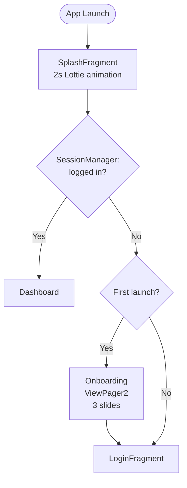
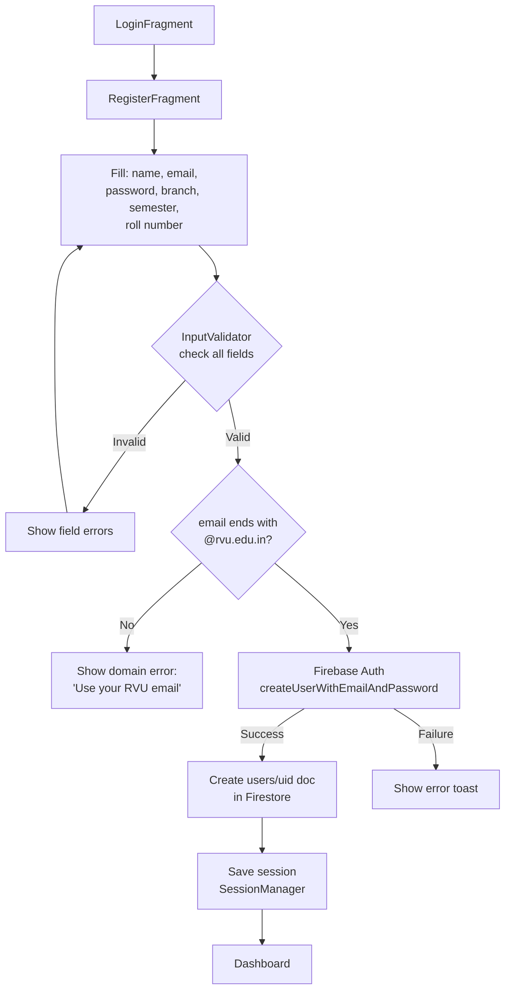
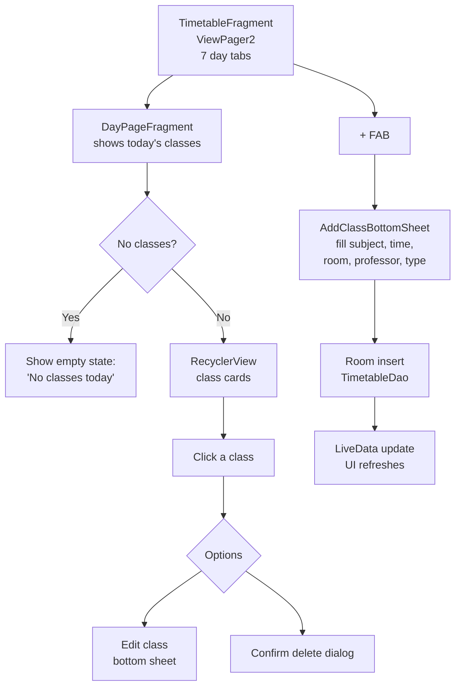
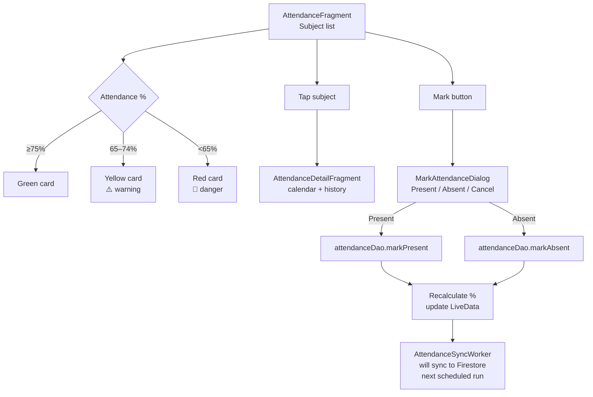
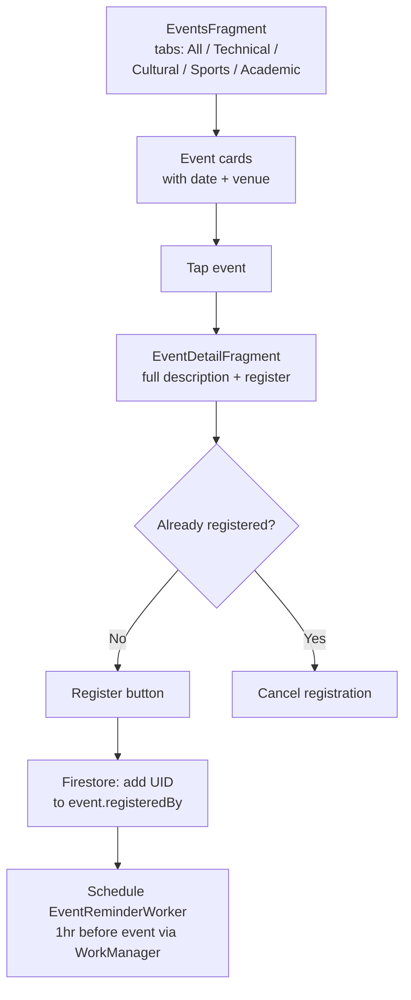
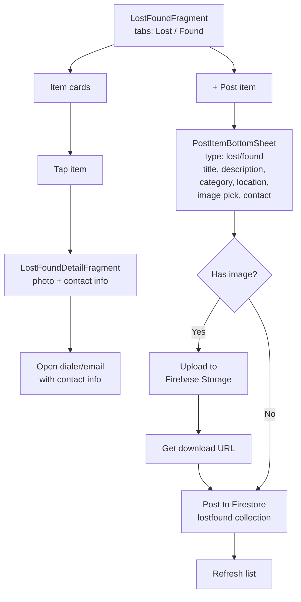
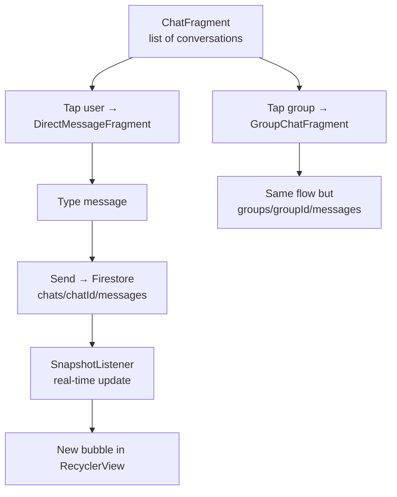
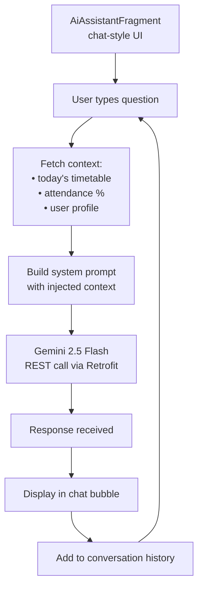
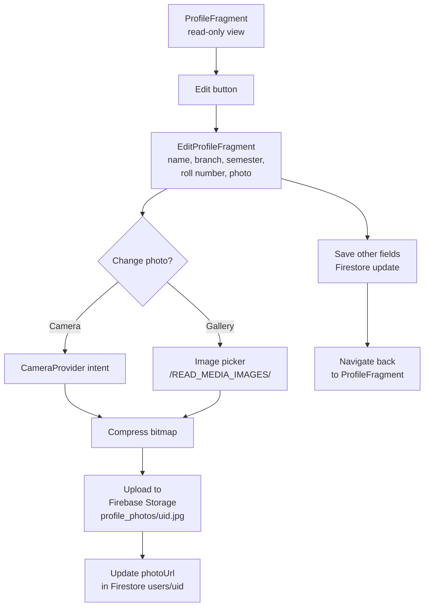
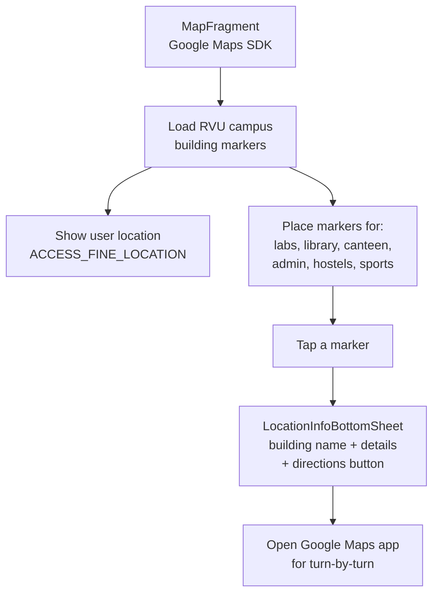

# 🔄 UI Flows

This document describes user journey flowcharts for all major features in Campus Companion.

---

## 1. App Launch Flow

---

## 2. Registration Flow

---

## 3. Timetable Flow

---

## 4. Attendance Flow

---

## 5. Events Flow

---

## 6. Lost & Found Flow

---

## 7. Chat Flow

---

## 8. AI Assistant Flow

---

## 9. Profile Flow

---

## 10. Campus Map Flow

